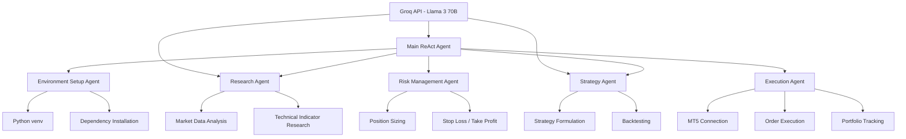
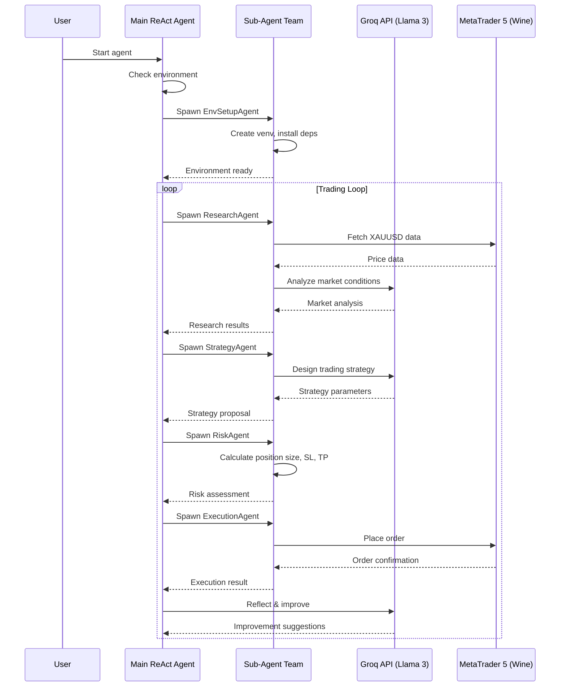
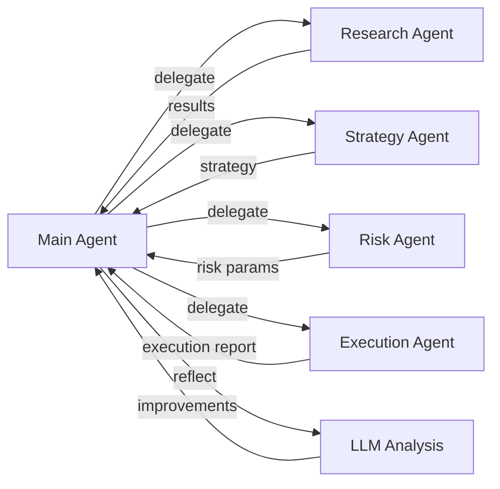

# LangChain ReAct Agent — XAUUSD MetaTrader 5 Trading Bot

## Architecture Plan

### 1. Overview

A **LangChain ReAct agent** powered by **Groq's free-tier LLM API** (Llama 3 70B) that:
- Builds its own environment (venv, dependencies)
- Creates a team of sub-agents to help it
- Connects to **MetaTrader 5** (via Wine on macOS) to trade **XAUUSD** (Gold vs USD)
- Uses **LangGraph** for stateful multi-agent orchestration
- Is completely free to run (no paid API keys)

### 2. System Architecture



### 3. Project Structure

```
/Users/martinsharkey/Langchain Bot/
├── .env                          # Groq API key (user provides)
├── .gitignore
├── README.md
├── requirements.txt
├── setup.sh                      # One-command setup script
│
├── src/
│   ├── main.py                   # Entry point - boots the main agent
│   ├── config.py                 # Configuration (symbols, timeframes, etc.)
│   │
│   ├── core/
│   │   ├── agent.py              # Main ReAct agent definition
│   │   ├── graph.py              # LangGraph state graph definition
│   │   ├── tools.py              # Shared tool definitions
│   │   └── llm.py                # Groq LLM client setup
│   │
│   ├── agents/
│   │   ├── base_agent.py         # Base sub-agent class
│   │   ├── env_setup_agent.py    # Creates venv, installs deps
│   │   ├── research_agent.py     # Market research & analysis
│   │   ├── strategy_agent.py     # Trading strategy design
│   │   ├── risk_agent.py         # Risk management
│   │   └── execution_agent.py    # MT5 order execution
│   │
│   ├── mt5/
│   │   ├── connector.py          # MT5 connection manager (Wine bridge)
│   │   ├── orders.py             # Order placement & management
│   │   ├── account.py            # Account info & balance
│   │   └── data.py               # Market data fetching
│   │
│   ├── strategies/
│   │   ├── base.py               # Base strategy class
│   │   ├── xauusd_strategy.py    # XAUUSD-specific strategy
│   │   └── indicators.py         # Technical indicators
│   │
│   └── utils/
│       ├── logger.py             # Logging setup
│       └── helpers.py            # Utility functions
│
└── tests/
    ├── test_agent.py
    ├── test_mt5.py
    └── test_strategies.py
```

### 4. Data Flow



### 5. Phase Breakdown

---

## Phase 1: Project Scaffolding & Environment Setup

**Goal**: Create the project structure, virtual environment, and install all dependencies.

**Files to create**:
- [`setup.sh`](setup.sh) — One-command bootstrap script that:
  1. Creates Python venv
  2. Activates it
  3. Installs all dependencies from `requirements.txt`
  4. Creates `.env` file template
- [`requirements.txt`](requirements.txt) — All Python dependencies
- [`.gitignore`](.gitignore) — Python/venv/IDE ignores
- [`src/config.py`](src/config.py) — Central configuration

**Dependencies**:
```
langchain>=0.3.0
langchain-groq>=0.2.0
langgraph>=0.2.0
langchain-community>=0.3.0
python-dotenv>=1.0.0
MetaTrader5>=5.0.45  # Note: requires Wine on macOS
pandas>=2.0.0
numpy>=1.24.0
ta>=0.10.0           # Technical Analysis library
rich>=13.0.0         # Pretty console output
```

**Key considerations**:
- `MetaTrader5` Python package is Windows-native. On macOS, it requires either:
  - **Wine** (already installed per user) to run the MT5 terminal
  - A bridge layer to communicate with the MT5 instance running under Wine
- The setup script must detect macOS and handle the Wine bridge

---

## Phase 2: Core Agent Framework

**Goal**: Build the main LangChain ReAct agent with LangGraph state management.

**Files to create**:
- [`src/core/llm.py`](src/core/llm.py) — Groq LLM client
  - Uses `ChatGroq` from `langchain-groq`
  - Model: `llama3-70b-8192` (free tier, 30 tokens/min, 6000 tokens/day)
  - Temperature: 0.7 for creative strategy, 0.2 for execution
- [`src/core/tools.py`](src/core/tools.py) — Shared tool definitions
  - `execute_shell_command` — Run shell commands (for env setup)
  - `read_file` / `write_file` — File operations
  - `python_repl` — Execute Python code
  - `web_search` — Search for trading info (optional, needs API)
- [`src/core/agent.py`](src/core/agent.py) — Main ReAct agent
  - Prompt template with system instructions
  - Agent's mission: "Build a team to trade XAUUSD on MT5"
  - Uses `create_react_agent` from LangGraph
- [`src/core/graph.py`](src/core/graph.py) — LangGraph state graph
  - State: `AgentState` with fields for:
    - `messages` — conversation history
    - `team_members` — list of spawned sub-agents
    - `environment_ready` — bool
    - `trading_active` — bool
    - `portfolio` — current positions/balance
  - Nodes: main agent, sub-agent dispatcher, tool executor
  - Edges: conditional routing based on agent decisions

**Key design decisions**:
- Use **LangGraph's `create_react_agent`** for the main agent loop
- The agent's system prompt instructs it to:
  1. First set up the environment (venv, deps)
  2. Then build its team (spawn sub-agents)
  3. Then begin the trading loop
- Sub-agents are implemented as **separate ReAct agents** that the main agent can spawn with specific tasks

---

## Phase 3: MetaTrader 5 Integration Layer

**Goal**: Create a robust connection to MT5 running under Wine on macOS.

**Files to create**:
- [`src/mt5/connector.py`](src/mt5/connector.py) — MT5 connection manager
  - Handles Wine bridge: MT5 terminal runs via Wine, Python connects via socket/IPC
  - `initialize()` — Start MT5 terminal under Wine if not running
  - `shutdown()` — Graceful disconnect
  - `is_connected()` — Health check
- [`src/mt5/account.py`](src/mt5/account.py) — Account operations
  - `get_account_info()` — Balance, equity, margin, free margin
  - `get_positions()` — Open positions
  - `get_history()` — Trade history
- [`src/mt5/data.py`](src/mt5/data.py) — Market data
  - `get_rates(symbol, timeframe, count)` — OHLCV data
  - `get_tick(symbol)` — Real-time tick
  - `get_symbol_info(symbol)` — Symbol specifications
- [`src/mt5/orders.py`](src/mt5/orders.py) — Order management
  - `place_order(symbol, type, volume, sl, tp, comment)`
  - `modify_order(ticket, sl, tp)`
  - `close_order(ticket)`
  - `get_open_orders()`

**Wine bridge approach**:
```python
# The MT5 terminal runs under Wine
# Python's MetaTrader5 package connects via local socket
# On macOS, we need to ensure the Wine process is running
# and the MT5 terminal is open with the correct account

import subprocess
import MetaTrader5 as mt5

def initialize_mt5():
    # Check if MT5 is running under Wine
    # If not, launch it
    # Then connect via mt5.initialize()
    pass
```

---

## Phase 4: Sub-Agent / Team-Building System

**Goal**: Create a system where the main agent can spawn and coordinate specialized sub-agents.

**Files to create**:
- [`src/agents/base_agent.py`](src/agents/base_agent.py) — Base sub-agent class
  - Each sub-agent is a LangGraph ReAct agent with its own tools and system prompt
  - `execute(task: str) -> str` — Run the sub-agent on a specific task
  - `get_status() -> str` — Report current status
- [`src/agents/env_setup_agent.py`](src/agents/env_setup_agent.py) — Environment setup
  - Tools: `execute_shell_command`, `write_file`, `read_file`
  - Mission: Create venv, install deps, verify everything works
- [`src/agents/research_agent.py`](src/agents/research_agent.py) — Market research
  - Tools: MT5 data fetching, technical indicators, web search (optional)
  - Mission: Analyze XAUUSD market conditions, identify trends
- [`src/agents/strategy_agent.py`](src/agents/strategy_agent.py) — Strategy design
  - Tools: Python REPL (for backtesting), file operations
  - Mission: Design and backtest trading strategies for XAUUSD
- [`src/agents/risk_agent.py`](src/agents/risk_agent.py) — Risk management
  - Tools: MT5 account info, calculator
  - Mission: Calculate position sizing, stop-loss, take-profit levels
- [`src/agents/execution_agent.py`](src/agents/execution_agent.py) — Order execution
  - Tools: MT5 order placement, account monitoring
  - Mission: Execute trades, monitor positions, report results

**Team orchestration flow**:


---

## Phase 5: XAUUSD Trading Strategy

**Goal**: Implement a trading strategy specifically for XAUUSD (Gold vs USD).

**Files to create**:
- [`src/strategies/base.py`](src/strategies/base.py) — Base strategy interface
  - `generate_signals(data) -> Signal`
  - `calculate_indicators(data) -> dict`
  - `validate(signal) -> bool`
- [`src/strategies/indicators.py`](src/strategies/indicators.py) — Technical indicators
  - Moving averages (SMA, EMA)
  - RSI, MACD, Bollinger Bands
  - Support/resistance levels
  - Volume analysis
- [`src/strategies/xauusd_strategy.py`](src/strategies/xauusd_strategy.py) — XAUUSD-specific
  - Gold-specific considerations:
    - Inverse correlation with USD
    - Sensitive to interest rates, inflation, geopolitics
    - London/New York session overlap = highest volatility
  - Multi-timeframe analysis (H1 for trend, M15 for entry)
  - Signal generation based on confluence of indicators

**Strategy parameters** (configurable by Strategy Agent):
- Timeframe: H1 (primary), M15 (entry)
- Indicators: EMA crossover + RSI confirmation + support/resistance
- Risk per trade: 1-2% of account
- Stop loss: ATR-based or structural level
- Take profit: 2:1 risk-reward ratio minimum

---

## Phase 6: Meta-Strategy Learning System (NEW)

**Goal**: Replace the single-strategy approach with a dynamic meta-strategy system that uses 7 individual strategies, RAG-based pattern matching via ChromaDB, and LLM-powered strategy selection.

### Architecture

```
┌─────────────────────────────────────────────────────────────┐
│                    MetaStrategyAgent                         │
│  (LLM-powered orchestrator that selects optimal strategy)    │
├─────────────────────────────────────────────────────────────┤
│                                                              │
│  ┌──────────────┐    ┌──────────────────┐                   │
│  │  Strategy     │    │  PatternMatcher  │                   │
│  │  Registry     │    │  (RAG Pipeline)  │                   │
│  │  (7 strats)   │    │                  │                   │
│  │              │    │  Queries vector   │                   │
│  │ • RSI_Mean   │    │  store for       │                   │
│  │ • EMA_Trend  │───▶│  similar hist.   │───▶ Decision      │
│  │ • MACD_Mom   │    │  patterns        │                   │
│  │ • BB_Bounce  │    │                  │                   │
│  │ • SR_Breakout│    └────────┬─────────┘                   │
│  │ • ATR_Break  │             │                             │
│  │ • Multi_Conf │    ┌────────▼─────────┐                   │
│  └──────────────┘    │  PatternVector   │                   │
│                      │  Store           │                   │
│  ┌──────────────┐    │  (ChromaDB)      │                   │
│  │ Experience   │    │  20-dim vectors  │                   │
│  │ Database     │    │  Persistent      │                   │
│  │ (SQLite)     │    └──────────────────┘                   │
│  │              │                                           │
│  │ Trade history│                                           │
│  │ Performance  │                                           │
│  │ Insights     │                                           │
│  └──────────────┘                                           │
└─────────────────────────────────────────────────────────────┘
```

### 7 Individual Strategies

| Strategy | Indicators | Best Regime | Description |
|----------|-----------|-------------|-------------|
| `RSI_MeanReversion` | RSI | Ranging/Quiet | Buy oversold (<30), sell overbought (>70) |
| `EMA_TrendFollow` | EMA fast/slow, Trend | Trending | Golden cross / death cross |
| `MACD_Momentum` | MACD histogram | Trending/Ranging | Trade with momentum direction |
| `BB_Bounce` | Bollinger Bands | Ranging/Quiet | Mean reversion at band extremes |
| `SR_Breakout` | S/R levels, ATR | Volatile/Trending | Breakout of key support/resistance |
| `ATR_Breakout` | ATR, Trend | Volatile | Volatility expansion with trend |
| `Multi_Confluence` | All major | All regimes | Highest confidence, most conservative |

### Decision Pipeline (3 Stages)

1. **ANALYZE**: Run all 7 strategies + query RAG pattern matcher
2. **REASON**: LLM evaluates results against historical patterns
3. **DECIDE**: Synthesize LLM + quantitative signals with conflict resolution

### Learning Loop

1. Every trade is stored as a 20-dimensional vector in ChromaDB
2. Trade outcomes are recorded in SQLite experience database
3. Future market conditions are compared via vector similarity (RAG)
4. Strategies that worked in similar conditions are preferred
5. Strategies that failed in similar conditions are penalized
6. The system gets smarter with every trade

### Files Created

| File | Purpose |
|------|---------|
| [`src/learning/vector_store.py`](src/learning/vector_store.py) | ChromaDB pattern storage with 20-dim feature vectors |
| [`src/learning/strategy_registry.py`](src/learning/strategy_registry.py) | 7 strategy functions + market regime detection |
| [`src/learning/pattern_matcher.py`](src/learning/pattern_matcher.py) | RAG pipeline for historical similarity search |
| [`src/learning/experience_db.py`](src/learning/experience_db.py) | SQLite trade outcome persistence |
| [`src/learning/meta_strategy_agent.py`](src/learning/meta_strategy_agent.py) | LLM-powered strategy orchestrator |

---

## Phase 7: Documentation & Run Instructions

**Files to create**:
- [`README.md`](README.md) — Full documentation
  - Project overview
  - Prerequisites (Python 3.11+, Wine, MT5, LLM API key)
  - Setup instructions
  - Usage instructions
  - Architecture overview
  - Meta-strategy learning system documentation
  - Troubleshooting

### 6. LLM Provider Configuration

The bot uses LiteLLM for multi-provider support. Configure at least one API key in `.env`:

| Provider | Env Variable | Free Tier Limits |
|----------|-------------|------------------|
| Groq | `GROQ_API_KEY` | 100K tokens/day, 30 RPM |
| Google Gemini | `GEMINI_API_KEY` | 60 requests/minute |
| Cerebras | `CEREBRAS_API_KEY` | 1M tokens/day |
| Mistral | `MISTRAL_API_KEY` | ~1B tokens/month |
| OpenRouter | `OPENROUTER_API_KEY` | ~22 free models, 200 RPD |
| SambaNova | `SAMBANOVA_API_KEY` | 200K tokens/day |
| Together AI | `TOGETHER_API_KEY` | Free research models |

**Fallback behavior**: If the primary provider is rate-limited, the system automatically falls back to the next configured provider. If all providers are exhausted, the system uses quantitative-only mode (no LLM evaluation).

### 7. Key Risks & Mitigations

| Risk | Mitigation |
|------|------------|
| MT5 Wine bridge unreliable | Implement connection retry logic, health checks |
| LLM API rate limits | Multi-provider fallback via LiteLLM, quantitative fallback |
| Trading losses | Strict risk management, paper trading first, max drawdown limits |
| Agent goes off-track | LangGraph allows human-in-the-loop intervention |
| macOS compatibility | All code tested on macOS, Wine-specific handling |
| Cold start (no historical data) | Strategies work independently without RAG; learning kicks in after first trades |

### 8. Getting Started (for the user)

1. Sign up for a free LLM API key (Groq at https://console.groq.com recommended)
2. Ensure MetaTrader 5 is installed and running under Wine (optional for simulation)
3. Run `chmod +x setup.sh && ./setup.sh`
4. Add at least one LLM API key to `.env`
5. Run `python src/main.py`
