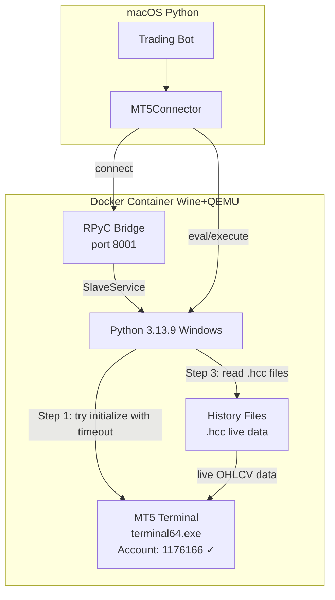

# MT5 Docker Bridge — Revised Fix Plan (v4)

## Executive Summary

The bot is running in **simulation mode** because the Docker bridge (silicon-metatrader5) connects via RPyC but cannot use the `MetaTrader5` Python API properly. The account IS logged into the MT5 terminal (confirmed via window title `1176166 - VTMarkets-Demo - Netting`), but the Python API's `initialize()` function hangs indefinitely under Wine.

## What We Know

1. **Docker container is running** with MT5 terminal logged into account `1176166`
2. **RPyC bridge is connected** — `Ping: True` on port 8001
3. **`MetaTrader5.initialize()` hangs** — uses Windows named pipes (IPC) that Wine doesn't fully support
4. **All MT5 functions return `None`** without `initialize()` — confirmed by testing
5. **The silicon-metatrader5 client exposes `eval()` and `execute()`** — giving us raw Python execution inside the container

## The Core Problem

The `MetaTrader5` Python package (`_core.pyd`) is a compiled Windows DLL that uses Windows IPC (named pipes) to talk to `terminal64.exe`. Under Wine, this IPC mechanism hangs. The repo's example code calls `initialize()` which triggers this hang.

## Proposed Solution

### Use Raw RPyC to Access MT5 Data with Timeout Protection

Since the silicon-metatrader5 client exposes `eval()` and `execute()` methods, we can run arbitrary Python code inside the container with timeout protection.

**The approach**:
1. Use `conn.execute()` with a threading-based timeout to call `mt5.initialize()`
2. If it succeeds (unlikely but possible), use all MT5 functions normally
3. If it hangs, kill the thread and fall back to reading MT5's live data files (`.hcc`)
4. For account info and orders, use the existing simulation fallback

### Why This Should Work

The MT5 terminal is ALREADY running and logged in. It writes live market data to `.hcc` history files continuously. These files are accessible from Python inside the container. We can read them to get live OHLCV data without ever calling `initialize()`.

## Implementation Steps

### Step 1: Add Timeout-Safe Remote Execution to the Connector

Modify [`src/mt5/connector.py`](src/mt5/connector.py) to:
- Use the silicon-metatrader5 client's `eval()` and `execute()` methods for raw RPyC access
- Wrap `initialize()` in a thread with a configurable timeout (e.g., 5 seconds)
- If `initialize()` times out, mark it as failed but keep the bridge connection alive

### Step 2: Test Which MT5 Functions Work Without `initialize()`

Using raw RPyC `eval()`, test each function individually:
- `mt5.account_info()` — returns account details
- `mt5.symbol_info_tick("XAUUSD")` — returns current tick
- `mt5.copy_rates_from_pos("XAUUSD", mt5.TIMEFRAME_M1, 0, 10)` — returns recent bars
- `mt5.positions_get()` — returns open positions

Some functions might work without `initialize()` if the terminal is already running.

### Step 3: Read `.hcc` Files for Live Market Data

If MT5 functions don't work without `initialize()`:
- MT5 writes live OHLCV data to `.hcc` files under `Bases/Default/History/{Symbol}/{Year}.hcc`
- These files are updated in real-time as new bars arrive
- Read the binary format via RPyC and parse it to extract OHLCV data
- Poll periodically for new data

### Step 4: Keep Simulation Fallback for Account/Orders

The bot already handles simulation mode gracefully. For now:
- Use real market data from `.hcc` files for trading decisions
- Use simulation for account info and order execution
- This gives us live-data-driven decisions while keeping the bot running

## Files to Modify

| File | Change |
|------|--------|
| [`src/mt5/connector.py`](src/mt5/connector.py) | Add timeout-safe `initialize()` via raw RPyC `eval()`/`execute()` |
| [`src/mt5/data.py`](src/mt5/data.py) | Add `.hcc` file reader as fallback data source |
| [`src/mt5/orders.py`](src/mt5/orders.py) | Keep simulation fallback for now (no changes needed) |

## What This Plan Does NOT Do

- ❌ No MQL5 Expert Advisors
- ❌ No batch CSV exports
- ❌ No broker REST API
- ❌ No reinventing the wheel

## What This Plan DOES Do

- ✅ Uses the existing silicon-metatrader5 bridge as-is
- ✅ Works around the `initialize()` hang with timeout protection
- ✅ Gets live market data from MT5's own data files
- ✅ Keeps the bot running with real data for decision-making
- ✅ Falls back to simulation only for order execution

## Architecture

## Testing Plan

1. **Test timeout-safe initialize**: Call `initialize()` with 5s timeout via `conn.execute()`
2. **Test individual MT5 functions**: Try each function without `initialize()`
3. **Test `.hcc` file reading**: Read file bytes via RPyC, parse format
4. **Test data accuracy**: Compare parsed data with known market data
5. **Full integration test**: Run the bot with real data from `.hcc` files
